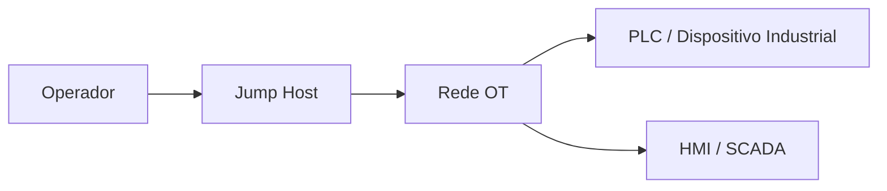

## 📋 Visão geral

Explica o cenário, o problema e a relevância para cibersegurança OT/ICS.

## 🎯 Objetivos de aprendizagem

- Objetivo 1
- Objetivo 2
- Objetivo 3

## ⚙️ Requisitos

- Docker
- Docker Compose
- Terminal Bash

## 🗺️ Topologia

## 📝 Tarefas

> [!WARNING]
> Todas as tarefas são estritamente educativas, observacionais e não intrusivas. Cumpre os padrões éticos e legais em vigor.

- [ ] 1️⃣ Tarefa 1
- [ ] 2️⃣ Tarefa 2
- [ ] 3️⃣ Tarefa 3

## ✅ Validação

Indica como o estudante confirma que atingiu os resultados esperados.

## 🔧 Troubleshooting

| Problema | Causa provável | Solução |
|---|---|---|
| Container não inicia | Porta ocupada | Verificar portas em uso |
| Sem conectividade | Rede Docker incorreta | Validar `docker network ls` |

## ❓ Questões de autoavaliação

1. Que ativos OT foram identificados?
2. Que riscos de segurança foram observados?
3. Que controlos mitigariam o problema?

## 📚 Referências

- Documentação oficial Docker
- MITRE ATT&CK for ICS
- Guias CISA para segurança ICS
