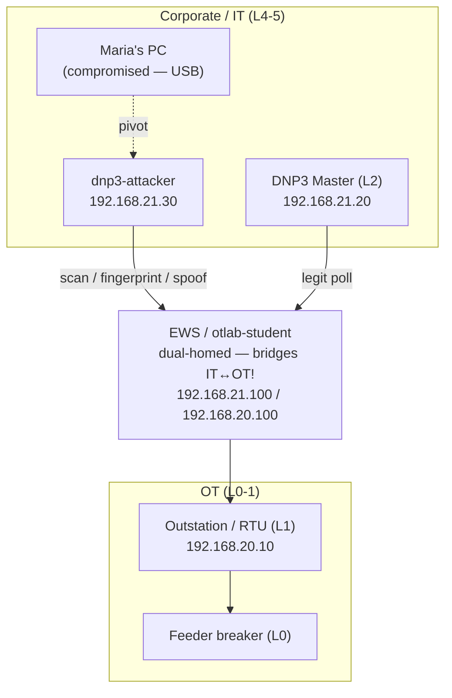
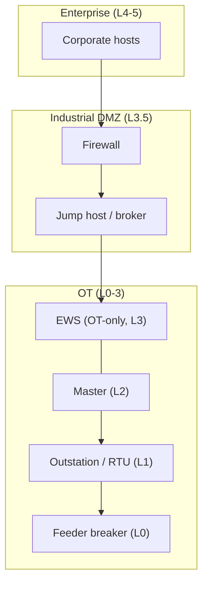

# Purdue Model Reference — current vs target architecture

> The visual heart of OTLab16. Use it to place hosts on Purdue levels (Action 1),
> to name the abused conduit (Action 3), and to justify the remediation (Action 7).
> Companion file: `IRPlaybookReference-EN.md` (process).

---

## 1. The Purdue model (PERA) in one screen

| Level       | Zone                      | Typical assets                                                         |
|-------------|---------------------------|------------------------------------------------------------------------|
| **L5 / L4** | Enterprise / Corporate IT | ERP, email, corporate apps, user PCs                                   |
| **L3.5**    | **Industrial DMZ (IDMZ)** | Firewalls, jump host, patch/historian mirror — the *only* IT↔OT broker |
| **L3**      | Manufacturing Operations  | Engineering workstation (EWS), historian, I/O server                   |
| **L2**      | Supervisory Control       | SCADA / HMI, DNP3 **master**                                           |
| **L1**      | Basic Control             | PLCs, RTUs — the DNP3 **outstation**                                   |
| **L0**      | Physical Process          | Sensors & actuators — the **feeder breaker**                           |

The rule the model encodes: **traffic flows between adjacent levels through
controlled conduits**, and **all IT↔OT traffic is brokered through the L3.5 IDMZ**.
Skipping levels — or bridging IT straight to OT — is the anti-pattern this incident
exploits.

## 2. This lab's hosts, mapped to Purdue (fill in Action 1)

| Host (container)        | IP                              | Purdue level        | Note                              |
|-------------------------|---------------------------------|---------------------|-----------------------------------|
| Maria's PC / corporate  | corp segment                    | L`{4/5}`            | initial compromise (USB)          |
| `dnp3-attacker`         | 192.168.21.30                   | L`{4/5}`            | adversary foothold on corp        |
| `otlab-student` (EWS)   | 192.168.20.100 / 192.168.21.100 | L`{3}` ↔ dual-homed | **bridges IT↔OT — the violation** |
| `dnp3-master`           | 192.168.21.20                   | L`{2}`              | sits on corp segment (smell)      |
| `dnp3-outstation` (RTU) | 192.168.20.10                   | L`{1}`              | field device                      |
| feeder breaker          | (simulated)                     | L`{0}`              | physical process                  |

## 3. Current architecture — *why the incident was possible*

The EWS is **dual-homed** and forwards between IT and OT; there is no IDMZ, and the
DNP3 master sits out on the corporate segment. Maria's compromised PC therefore has
a transitive path all the way to the L1 outstation.

> The attacker's path and the legitimate poll **share the same conduit** through the
> EWS. That is exactly why containment must be surgical (drop the attacker, keep the
> poll) and not a blanket corp↔OT cut.

## 4. Target architecture — *how it should be (the remediation)*

Introduce an **IDMZ at L3.5**, move the master down into OT (L2), make the EWS
OT-only, and force all IT↔OT traffic through a firewall + jump host. There is then
**no direct path** from a compromised corporate host to the outstation.

## 5. The through-line

The incident was only possible because the **current** architecture violates the
Purdue model: no IT/OT separation and a dual-homed EWS acting as an uncontrolled
conduit. The cure delivered in Post-Incident (Action 7) is the **target**
architecture — the IDMZ and segmentation — which is also the MITRE ATT&CK for ICS
mitigation **M0930 Network Segmentation**. This closes the loop from *Respond*
(Action 4 cuts the conduit tactically) to *Improve* (Action 7 removes it
architecturally).

## 6. Where the model strains — IIoT & the cloud (food for thought)

The Purdue model assumes a tidy hierarchy with traffic flowing **only between
adjacent levels** through controlled conduits. That assumption was reasonable when
field devices were dumb and connectivity was scarce. IIoT and cloud integration
quietly break it — worth keeping in mind before treating "achieve Purdue" as the
end state rather than a baseline.

- **Level-skipping by design.** An IIoT sensor that ships telemetry straight to a
  cloud platform (MQTT/HTTPS out) collapses L0–L1 into L4-and-beyond in a single
  hop. The neat L3.5 broker is bypassed not by an attacker but by the *intended*
  data path.
- **The IDMZ stops being the only door.** Purdue's whole security argument rests on
  IT↔OT traffic being funneled through one controlled choke point. Cloud-managed
  devices, vendor remote-access agents, and "phone-home" firmware each open an
  outbound conduit the IDMZ never sees.
- **North–south vs. east–west.** The model reasons about vertical flows between
  levels; IIoT adds dense **east–west** chatter (device-to-device, device-to-broker)
  and **outbound** cloud links that the layered diagram doesn't naturally express.
- **Trust boundary moves off-site.** When control logic or analytics live in a
  SaaS/cloud tenant, part of L3/L4 now sits outside the plant entirely — the
  perimeter you're defending no longer has a fence you own.
- **Blurred device identity.** A single IIoT gateway can simultaneously be a field
  sensor (L0/L1), a protocol translator (L2/L3), and a cloud client (L4+). Placing
  it on one Purdue level — the very first thing Action 1 asks you to do — stops
  being a clean call.

**So what?** The response isn't to discard Purdue but to layer **zero-trust /
ISA-62443 zones-and-conduits** thinking on top of it: identity- and policy-based
segmentation per flow, explicit allow-lists for outbound cloud conduits, and
treating each IIoT data path as a conduit that needs the same scrutiny as the EWS
bridge in this lab. The incident here was a *level-skipping* failure (a dual-homed
host); IIoT makes level-skipping the **default**, so the architectural cure in
Section 4 becomes a starting point, not the finish line.
