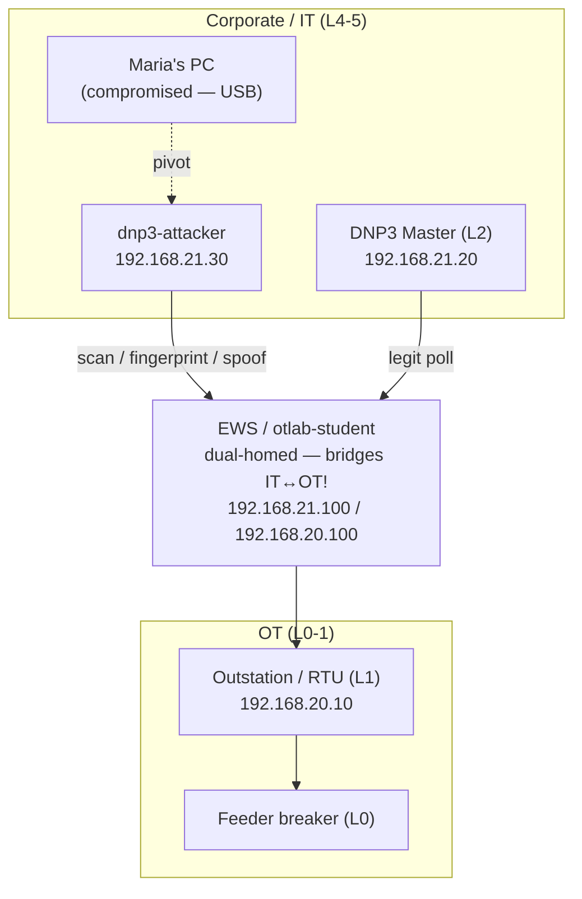
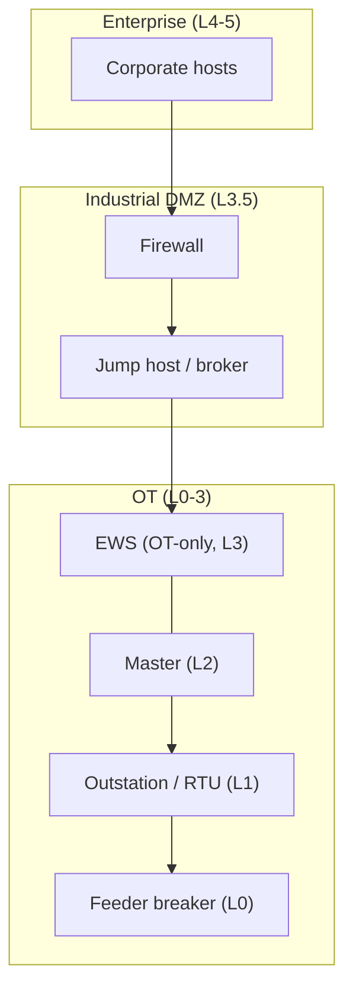

# Purdue Model Reference — arquitectura actual vs objetivo

> El corazón visual del OTLab16. Úsalo para colocar hosts en niveles Purdue (Acción 1),
> para nombrar el conduit abusado (Acción 3) y para justificar la remediación (Acción 7).
> Fichero compañero: `IRPlaybookReference-ES.md` (proceso).

---

## 1. El modelo Purdue (PERA) en una pantalla

| Nivel       | Zona                      | Activos típicos                                                        |
|-------------|---------------------------|------------------------------------------------------------------------|
| **L5 / L4** | Empresa / IT Corporativo  | ERP, email, aplicaciones corporativas, PCs de usuario                  |
| **L3.5**    | **DMZ Industrial (IDMZ)** | Firewalls, jump host, espejo de patch/historian — el *único* intermediario IT↔OT |
| **L3**      | Operaciones de Fabricación | Estación de trabajo de ingeniería (EWS), historian, servidor de I/O   |
| **L2**      | Control de Supervisión    | SCADA / HMI, **master** DNP3                                           |
| **L1**      | Control Básico            | PLCs, RTUs — la **outstation** DNP3                                    |
| **L0**      | Proceso Físico            | Sensores y actuadores — el **interruptor de alimentador**             |

La regla que el modelo codifica: **el tráfico fluye entre niveles adyacentes a través
de conduits controlados**, y **todo el tráfico IT↔OT es intermediado por la IDMZ de
L3.5**. Saltar niveles — o conectar IT directamente a OT — es el anti-patrón que este
incidente explota.

## 2. Los hosts de este laboratorio, mapeados a Purdue (rellenar en la Acción 1)

| Host (contenedor)       | IP                              | Nivel Purdue        | Nota                              |
|-------------------------|---------------------------------|---------------------|-----------------------------------|
| PC de María / corporativo | segmento corporativo          | L`{4/5}`            | compromiso inicial (USB)          |
| `dnp3-attacker`         | 192.168.21.30                   | L`{4/5}`            | punto de apoyo del adversario en corp |
| `otlab-student` (EWS)   | 192.168.20.100 / 192.168.21.100 | L`{3}` ↔ dual-homed | **hace puente IT↔OT — la violación** |
| `dnp3-master`           | 192.168.21.20                   | L`{2}`              | está en el segmento corp (mala señal) |
| `dnp3-outstation` (RTU) | 192.168.20.10                   | L`{1}`              | dispositivo de campo              |
| interruptor de alimentador | (simulado)                   | L`{0}`              | proceso físico                    |

## 3. Arquitectura actual — *por qué el incidente fue posible*

La EWS está **dual-homed** y reenvía entre IT y OT; no hay IDMZ, y el master DNP3
está fuera, en el segmento corporativo. El PC comprometido de María tiene, por tanto,
un camino transitivo hasta la outstation L1.

> El camino del atacante y el poll legítimo **comparten el mismo conduit** a través de
> la EWS. Es exactamente por eso que la contención debe ser quirúrgica (dropear al
> atacante, mantener el poll) y no un corte total corp↔OT.

## 4. Arquitectura objetivo — *cómo debería ser (la remediación)*

Introducir una **IDMZ en L3.5**, bajar el master a OT (L2), hacer la EWS
exclusivamente OT y forzar todo el tráfico IT↔OT por un firewall + jump host. Deja de
existir **camino directo** de un host corporativo comprometido a la outstation.

## 5. El hilo conductor

El incidente solo fue posible porque la arquitectura **actual** viola el modelo
Purdue: sin separación IT/OT y con una EWS dual-homed actuando como conduit no
controlado. La cura entregada en el Post-Incidente (Acción 7) es la arquitectura
**objetivo** — la IDMZ y la segmentación — que es también la mitigación MITRE ATT&CK
for ICS **M0930 Network Segmentation**. Esto cierra el ciclo de *Respond* (la Acción 4
corta el conduit tácticamente) a *Improve* (la Acción 7 lo elimina arquitectónicamente).

## 6. Dónde el modelo se tensiona — IIoT & la nube (para reflexión)

El modelo Purdue asume una jerarquía ordenada con tráfico fluyendo **solo entre
niveles adyacentes** por conduits controlados. Ese supuesto era razonable cuando los
dispositivos de campo eran "tontos" y la conectividad escasa. La integración IIoT y
nube lo rompe discretamente — vale la pena tenerlo en mente antes de tratar
"alcanzar Purdue" como el estado final en lugar de una baseline.

- **Salto de niveles por diseño.** Un sensor IIoT que envía telemetría directamente a
  una plataforma nube (MQTT/HTTPS hacia fuera) colapsa L0–L1 en L4-y-más-allá en un
  único salto. El intermediario L3.5 elegante es evitado, no por un atacante, sino por
  el camino de datos *previsto*.
- **La IDMZ deja de ser la única puerta.** Todo el argumento de seguridad de Purdue
  se apoya en que el tráfico IT↔OT sea canalizado por un único punto de
  estrangulamiento controlado. Dispositivos gestionados en la nube, agentes de acceso
  remoto de proveedores y firmware "phone-home" abren cada uno un conduit de salida
  que la IDMZ nunca ve.
- **Norte–sur vs este–oeste.** El modelo razona sobre flujos verticales entre niveles;
  el IIoT añade densa conversación **este–oeste** (dispositivo-a-dispositivo,
  dispositivo-a-broker) y enlaces **de salida** hacia la nube que el diagrama en capas
  no expresa naturalmente.
- **La frontera de confianza se mueve fuera del sitio.** Cuando la lógica de control o
  la analítica viven en un tenant SaaS/nube, parte de L3/L4 pasa a estar fuera de la
  instalación — el perímetro que defiendes ya no tiene una valla que sea tuya.
- **Identidad de dispositivo difusa.** Un único gateway IIoT puede ser simultáneamente
  un sensor de campo (L0/L1), un traductor de protocolo (L2/L3) y un cliente nube
  (L4+). Colocarlo en un único nivel Purdue — lo primerísimo que la Acción 1 pide —
  deja de ser una decisión limpia.

**¿Y entonces?** La respuesta no es descartar Purdue, sino superponerle pensamiento de
**zero-trust / zonas-y-conduits ISA-62443**: segmentación basada en identidad y
política por flujo, allowlists explícitas para conduits de salida hacia la nube, y
tratar cada camino de datos IIoT como un conduit que necesita el mismo escrutinio que
el puente de la EWS en este laboratorio. El incidente aquí fue un fallo de *salto de
niveles* (un host dual-homed); el IIoT hace del salto de niveles el **estándar**, por
lo que la cura arquitectónica de la Sección 4 pasa a ser un punto de partida, no la
línea de meta.
