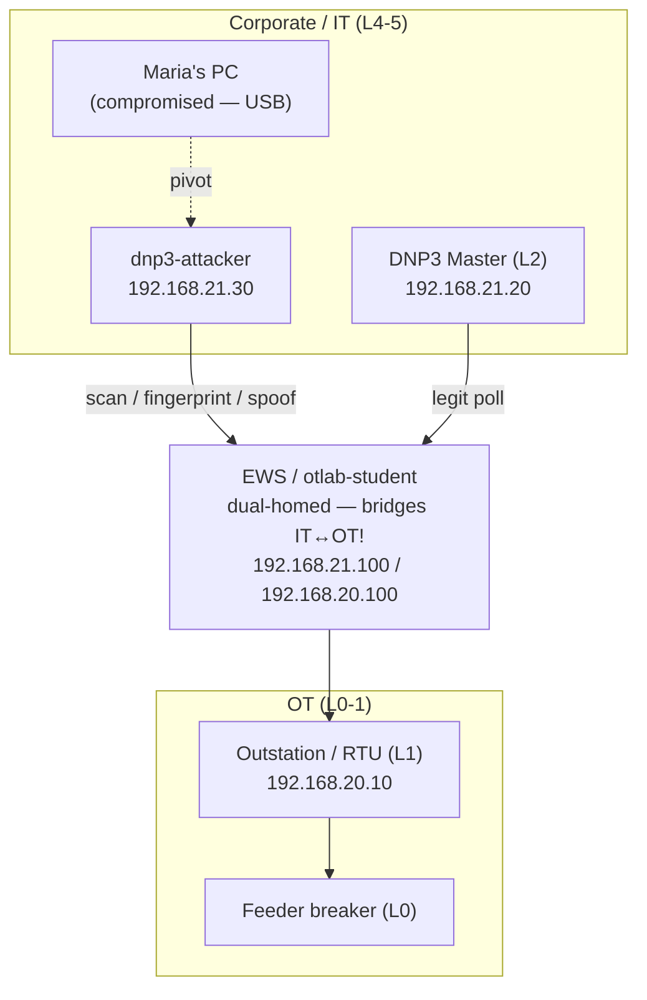
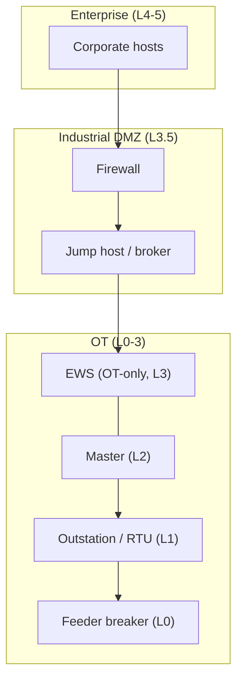

# Purdue Model Reference — arquitetura atual vs alvo

> O coração visual do OTLab16. Usa-o para colocar hosts em níveis Purdue (Ação 1),
> para nomear o conduit abusado (Ação 3) e para justificar a remediação (Ação 7).
> Ficheiro companheiro: `IRPlaybookReference.md` (processo).

---

## 1. O modelo Purdue (PERA) num ecrã

| Nível       | Zona                      | Ativos típicos                                                         |
|-------------|---------------------------|------------------------------------------------------------------------|
| **L5 / L4** | Empresa / IT Corporativo  | ERP, email, aplicações corporativas, PCs de utilizador                 |
| **L3.5**    | **DMZ Industrial (IDMZ)** | Firewalls, jump host, espelho de patch/historian — o *único* intermediário IT↔OT |
| **L3**      | Operações de Fabrico      | Estação de trabalho de engenharia (EWS), historian, servidor de I/O    |
| **L2**      | Controlo de Supervisão    | SCADA / HMI, **master** DNP3                                           |
| **L1**      | Controlo Básico           | PLCs, RTUs — a **outstation** DNP3                                     |
| **L0**      | Processo Físico           | Sensores e atuadores — o **disjuntor de alimentador**                  |

A regra que o modelo codifica: **o tráfego flui entre níveis adjacentes através de
conduits controlados**, e **todo o tráfego IT↔OT é intermediado pela IDMZ de L3.5**.
Saltar níveis — ou ligar IT diretamente a OT — é o anti-padrão que este incidente
explora.

## 2. Os hosts deste laboratório, mapeados a Purdue (preencher na Ação 1)

| Host (contentor)        | IP                              | Nível Purdue        | Nota                              |
|-------------------------|---------------------------------|---------------------|-----------------------------------|
| PC da Maria / corporativo | segmento corporativo          | L`{4/5}`            | compromisso inicial (USB)         |
| `dnp3-attacker`         | 192.168.21.30                   | L`{4/5}`            | ponto de apoio do adversário em corp |
| `otlab-student` (EWS)   | 192.168.20.100 / 192.168.21.100 | L`{3}` ↔ dual-homed | **faz ponte IT↔OT — a violação**  |
| `dnp3-master`           | 192.168.21.20                   | L`{2}`              | está no segmento corp (mau sinal) |
| `dnp3-outstation` (RTU) | 192.168.20.10                   | L`{1}`              | dispositivo de campo              |
| disjuntor de alimentador | (simulado)                     | L`{0}`              | processo físico                   |

## 3. Arquitetura atual — *porque o incidente foi possível*

A EWS está **dual-homed** e encaminha entre IT e OT; não há IDMZ, e o master DNP3
está fora, no segmento corporativo. O PC comprometido da Maria tem, portanto, um
caminho transitivo até à outstation L1.

> O caminho do atacante e o poll legítimo **partilham o mesmo conduit** através da
> EWS. É exatamente por isso que a contenção tem de ser cirúrgica (dropar o atacante,
> manter o poll) e não um corte total corp↔OT.

## 4. Arquitetura alvo — *como deveria ser (a remediação)*

Introduzir uma **IDMZ em L3.5**, descer o master para OT (L2), tornar a EWS
exclusivamente OT e forçar todo o tráfego IT↔OT por uma firewall + jump host. Deixa
de existir **caminho direto** de um host corporativo comprometido para a outstation.

## 5. O fio condutor

O incidente só foi possível porque a arquitetura **atual** viola o modelo Purdue:
sem separação IT/OT e com uma EWS dual-homed a atuar como conduit não controlado. A
cura entregue no Pós-Incidente (Ação 7) é a arquitetura **alvo** — a IDMZ e a
segmentação — que é também a mitigação MITRE ATT&CK for ICS **M0930 Network
Segmentation**. Isto fecha o ciclo de *Respond* (a Ação 4 corta o conduit
taticamente) para *Improve* (a Ação 7 remove-o arquiteturalmente).

## 6. Onde o modelo se esforça — IIoT & a cloud (para reflexão)

O modelo Purdue assume uma hierarquia arrumada com tráfego a fluir **apenas entre
níveis adjacentes** por conduits controlados. Esse pressuposto era razoável quando os
dispositivos de campo eram "burros" e a conectividade escassa. A integração IIoT e
cloud quebra-o discretamente — vale a pena ter isto em mente antes de tratar
"alcançar Purdue" como o estado final em vez de uma baseline.

- **Salto de níveis por desenho.** Um sensor IIoT que envia telemetria diretamente
  para uma plataforma cloud (MQTT/HTTPS para fora) colapsa L0–L1 em L4-e-além num
  único salto. O intermediário L3.5 elegante é contornado, não por um atacante, mas
  pelo caminho de dados *pretendido*.
- **A IDMZ deixa de ser a única porta.** Todo o argumento de segurança do Purdue
  assenta em o tráfego IT↔OT ser canalizado por um único ponto de estrangulamento
  controlado. Dispositivos geridos na cloud, agentes de acesso remoto de fornecedores
  e firmware "phone-home" abrem cada um um conduit de saída que a IDMZ nunca vê.
- **Norte–sul vs este–oeste.** O modelo raciocina sobre fluxos verticais entre
  níveis; o IIoT adiciona densa conversa **este–oeste** (dispositivo-a-dispositivo,
  dispositivo-a-broker) e ligações **de saída** para a cloud que o diagrama em camadas
  não expressa naturalmente.
- **A fronteira de confiança move-se para fora.** Quando a lógica de controlo ou a
  analítica vivem num tenant SaaS/cloud, parte de L3/L4 passa a estar fora da
  instalação — o perímetro que defendes já não tem uma cerca que seja tua.
- **Identidade de dispositivo difusa.** Um único gateway IIoT pode ser
  simultaneamente um sensor de campo (L0/L1), um tradutor de protocolo (L2/L3) e um
  cliente cloud (L4+). Colocá-lo num único nível Purdue — a primeiríssima coisa que a
  Ação 1 pede — deixa de ser uma decisão limpa.

**E então?** A resposta não é descartar o Purdue, mas sobrepor-lhe pensamento de
**zero-trust / zonas-e-conduits ISA-62443**: segmentação baseada em identidade e
política por fluxo, allowlists explícitas para conduits de saída para a cloud, e
tratar cada caminho de dados IIoT como um conduit que precisa do mesmo escrutínio que
a ponte da EWS neste laboratório. O incidente aqui foi uma falha de *salto de níveis*
(um host dual-homed); o IIoT torna o salto de níveis o **padrão**, por isso a cura
arquitetural da Secção 4 passa a ser um ponto de partida, não a linha de chegada.
